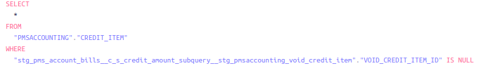
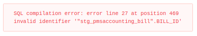

  # Using subqueries or CTEs in Cube.js

When using subqueries/CTEs in Cube, it brings attention to several flaws from the product. To illustrate it, we will use the following query:

```sql
SELECT c.account_id, 
    b.customer_id, 
    b.business_unit_id,
    b.bill_id, 
    b.post_date,
    SUM(bi.amount) AS "bill_items_sum",
    (
        SELECT SUM(ci.amount) 
        FROM accounting.credit_item ci 
        LEFT JOIN accounting.void_credit_item vci ON vci.credit_item_id = ci.credit_item_id 
        WHERE ci.bill_id = b.bill_id AND vci.void_credit_item_id IS NULL
    ) AS "credit_items_sum"
FROM accounting.charge c 
LEFT JOIN accounting.bill_item bi ON bi.bill_item_id = c.bill_item_id
LEFT JOIN accounting.bill b ON b.bill_id = bi.bill_id
WHERE b.post_date <= $starting_date::timestamp
GROUP BY b.bill_id, c.account_id
```

The first step would be to build the subquery from the table `credit_item` as a common cube schema:

```js
cube(`stg_pms_creditItemsSum_CS`, {
    sql: `SELECT * FROM ${raw_pmsaccounting_creditItem.sql()}`,

    joins: {

      stg_pmsaccounting_voidCreditItem: {
          sql: `${stg_pms_creditItemsSum_CS.billId} = ${stg_pmsaccounting_voidCreditItem.creditItemId}`,
          relationship: `hasOne`
        },
        
      },
    
      measures: {
        creditSum: {
          sql: `${stg_pms_creditItemsSum_CS}.amount`,
          type: `sum`
        }
      },
      
      dimensions: {

        billId: {
          sql: `${CUBE}.BILL_ID`,
          type: `string`,
          primaryKey: true
        }

      },

      segments: {
        voidCreditSegment: {
            sql: `
            ${stg_pmsaccounting_voidCreditItem.voidCreditItemId} IS NULL`
        },
      },

      dataSource: `snowflake_pms`
    });
``` 

The only difference between the original SQL is the `billId` dimension, which would be used to join the next Cube created.

Then, the final schema would look like this:

```js
      cube(`stg_pms_accountBills_CS`, {
        sql: `SELECT * FROM ${raw_pmsaccounting_charge.sql()}`,
    
        joins: {
    
          stg_pmsaccounting_billItem: {
              sql: `${stg_pmsaccounting_billItem.billItemId} = ${stg_pms_accountBills_CS}.bill_item_id`,
              relationship: `hasOne`
          },
            
        },
            
        measures: {
          billAmount: {
            sql: `${stg_pmsaccounting_billItem.amount}`,
            type: `sum`
          },
    
        },
        
        dimensions: {
            
            accountId: {
              sql: `${CUBE}."ACCOUNT_ID"`,
              type: `string`,
              primaryKey: true,
              shown: true
            },

            customerId: {
              sql: `${stg_pmsaccounting_bill.customerId}`,
              type: `string`
            },

            businessUnitId: {
              sql: `${stg_pmsaccounting_bill.businessUnitId}`,
              type: `string`
            },

            billId: {
              sql: `${stg_pmsaccounting_bill.billId}`,
              type: `string`,
              primaryKey: true
            },

            postDate: {
              sql: `${stg_pmsaccounting_bill.postDate}`,
              type: `time`
            },

            creditAmount: {
              sql: `${stg_pms_creditItemsSum_CS.creditSum}`,
              type: `number`,
              subQuery: true
            },
        },
        
        dataSource: `snowflake_pms`
        });
```

## Issues regarding the subQuery parameter

The `subQuery` parameter is used so that Cube makes the already calculated measure `creditSum` becomes a dimension.

But the first issue happens when invoking the schema with a Cube payload created in the Cube Playground:



The first issue faced is the join that is supposed to happen with the `void_credit` table never happens because a column is never requested by the Cube payload. So, what we need to do instead of defining it in the where is to use a `segment`, which is a pre-defined filter on Cube.js.



The second issue, which makes creating that Cube impossible, is the wrong join order Cube uses in the SQL generated, as shown [here](second-image) and can also be illustrated here:

```sql
SELECT
  "stg_pms_account_bills__c_s"."ACCOUNT_ID" "stg_pms_account_bills__c_s__account_id",
  "stg_pmsaccounting_bill"."CUSTOMER_ID" "stg_pms_account_bills__c_s__customer_id",
  "stg_pms_account_bills__c_s__credit_amount" "stg_pms_account_bills__c_s__credit_amount",
  "stg_pmsaccounting_bill"."BUSINESS_UNIT_ID" "stg_pms_account_bills__c_s__business_unit_id",
  "stg_pmsaccounting_bill".BILL_ID "stg_pms_account_bills__c_s__bill_id",
  date_trunc('day', "stg_pmsaccounting_bill".post_date) "stg_pms_account_bills__c_s__post_date",
  sum("stg_pmsaccounting_bill_item"."AMOUNT") "stg_pms_account_bills__c_s__bill_amount"
FROM
  (
    SELECT
      *
    FROM
      (
        SELECT
          convert_timezone(
            'UTC',
            com.timezone_id,
            TO_TIMESTAMP_NTZ(ch.DUE_DATE)
          ) AS DUE_DATE,
          convert_timezone(
            'UTC',
            com.timezone_id,
            TO_TIMESTAMP_NTZ(ch.POST_DATE)
          ) AS POST_DATE,
          ch.* exclude (due_date, post_date)
        FROM
          "PMSACCOUNTING"."CHARGE" ch
          LEFT JOIN "PMSACCOUNTING"."CODE" c ON c.id = ch.code_id
          left join "PMSAUTH"."COMMUNITIES" com on c.community_id = com.id
      )
  ) AS "stg_pms_account_bills__c_s"
  LEFT JOIN (
    SELECT
      "stg_pms_account_bills__c_s_credit_amount_subquery__stg_pmsaccounting_bill".BILL_ID "stg_pms_account_bills__c_s__bill_id",
      sum(
        "stg_pms_account_bills__c_s_credit_amount_subquery__stg_pms_credit_items_sum__c_s".amount
      ) "stg_pms_account_bills__c_s__credit_amount"
    FROM
      (
        SELECT
          *
        FROM
          (
            SELECT
              convert_timezone(
                'UTC',
                com.timezone_id,
                TO_TIMESTAMP_NTZ(ch.DUE_DATE)
              ) AS DUE_DATE,
              convert_timezone(
                'UTC',
                com.timezone_id,
                TO_TIMESTAMP_NTZ(ch.POST_DATE)
              ) AS POST_DATE,
              ch.* exclude (due_date, post_date)
            FROM
              "PMSACCOUNTING"."CHARGE" ch
              LEFT JOIN "PMSACCOUNTING"."CODE" c ON c.id = ch.code_id
              left join "PMSAUTH"."COMMUNITIES" com on c.community_id = com.id
          )
      ) AS "stg_pms_account_bills__c_s_credit_amount_subquery__stg_pms_account_bills__c_s"
      LEFT JOIN "PMSACCOUNTING"."BILL_ITEM" AS "stg_pms_account_bills__c_s_credit_amount_subquery__stg_pmsaccounting_bill_item" ON "stg_pms_account_bills__c_s_credit_amount_subquery__stg_pmsaccounting_bill_item"."BILL_ITEM_ID" = "stg_pms_account_bills__c_s_credit_amount_subquery__stg_pms_account_bills__c_s".bill_item_id
      LEFT JOIN (
        SELECT
          *
        FROM
          (
            select
              convert_timezone(
                'UTC',
                com.timezone_id,
                TO_TIMESTAMP_NTZ(b.POST_DATE)
              ) POST_DATE,
              b.* exclude POST_DATE
            from
              "PMSACCOUNTING"."BILL" b
              left join "PMSAUTH"."COMMUNITIES" com on b.business_unit_id = com.id
          )
      ) AS "stg_pms_account_bills__c_s_credit_amount_subquery__stg_pmsaccounting_bill" ON "stg_pms_account_bills__c_s_credit_amount_subquery__stg_pmsaccounting_bill".BILL_ID = "stg_pms_account_bills__c_s_credit_amount_subquery__stg_pmsaccounting_bill_item"."BILL_ID"
      LEFT JOIN "PMSACCOUNTING"."CREDIT_ITEM" AS "stg_pms_account_bills__c_s_credit_amount_subquery__stg_pms_credit_items_sum__c_s" ON "stg_pms_account_bills__c_s_credit_amount_subquery__stg_pms_credit_items_sum__c_s".BILL_ID = "stg_pms_account_bills__c_s_credit_amount_subquery__stg_pmsaccounting_bill".BILL_ID
    GROUP BY
      1
  ) AS "stg_pms_account_bills__c_s_credit_amount_subquery" ON "stg_pms_account_bills__c_s_credit_amount_subquery"."stg_pms_account_bills__c_s__bill_id" = "stg_pmsaccounting_bill".BILL_ID
  LEFT JOIN "PMSACCOUNTING"."BILL_ITEM" AS "stg_pmsaccounting_bill_item" ON "stg_pmsaccounting_bill_item"."BILL_ITEM_ID" = "stg_pms_account_bills__c_s".bill_item_id
  LEFT JOIN (
    SELECT
      *
    FROM
      (
        select
          convert_timezone(
            'UTC',
            com.timezone_id,
            TO_TIMESTAMP_NTZ(b.POST_DATE)
          ) POST_DATE,
          b.* exclude POST_DATE
        from
          "PMSACCOUNTING"."BILL" b
          left join "PMSAUTH"."COMMUNITIES" com on b.business_unit_id = com.id
      )
  ) AS "stg_pmsaccounting_bill" ON "stg_pmsaccounting_bill".BILL_ID = "stg_pmsaccounting_bill_item"."BILL_ID"
  LEFT JOIN "PMSACCOUNTING"."CREDIT_ITEM" AS "stg_pms_credit_items_sum__c_s" ON "stg_pms_credit_items_sum__c_s".BILL_ID = "stg_pmsaccounting_bill".BILL_ID
  LEFT JOIN "PMSACCOUNTING"."VOID_CREDIT_ITEM" AS "stg_pmsaccounting_void_credit_item" ON "stg_pms_credit_items_sum__c_s".BILL_ID = "stg_pmsaccounting_void_credit_item"."CREDIT_ITEM_ID"
WHERE
  (
    "stg_pmsaccounting_void_credit_item"."VOID_CREDIT_ITEM_ID" IS NULL
  )
GROUP BY
  1,
  2,
  3,
  4,
  5,
  6
ORDER BY
  1 ASC,
  2 ASC,
  5 ASC,
  6 ASC
LIMIT
  10000
```

The error happens because the join `"stg_pms_account_bills__c_s_credit_amount_subquery" ON "stg_pms_account_bills__c_s_credit_amount_subquery"."stg_pms_account_bills__c_s__bill_id" = "stg_pmsaccounting_bill".BILL_ID` happens before the table `stg_pmsaccounting_bill` is even stated. The issue happened when the `billId` column was defined as primaryKey in Cube, but without it the Cube result comes off wrong.

# General issues with the Cube schema

Another main issue with generating "pre-queries" using Cube syntax is the complexity generated. The first thing worth mentioning is the comparison in complexity between the [first query](#using-subqueries-or-CTEs-in-Cube.js) which was generated manually and the [sql query generated automatically by Cube](#issues-regarding-the-subQuery-parameter) is absurd, with the first one having **16 lines**, while the second one has **120 lines**. Besides the Cube SQL not working, there are some other points worth mentioning:

- Messing with joins in Cube can get complex real quick. If your business schema have to join against 4 tables, for instance, it will define the join order based on the order you call the fields in the Cube payload. That can lead to errors because sometimes you have to do a join with a table that isn't even demanded by the Cube payload (which is the responsible for specifying the columns being returned) and the final SQL doesn't work. This can be avoided by defining the joins in different schemas, which makes sense in a way but makes thing harder to develop. Also, you have to define if the join is one-to-one, many-to-one or one-to-many.
- This point is redudant but it's still worth mentioning: these minor difficulties already explained make the Cube schemas being a lot more verbose and a lot harder to debug, which makes development time **at least** 5 times higher. For instance, writing this document and creating this Cube schema took around 4 to 5 days, while defining them using sample SQL just for the subqueries and using Cube syntax for the business layer took somewhere around 2-3 hours, which look something like this:

```js
cube(`stg_pms_creditItemsSum`, {
    sql: `
    SELECT 
        bill_id, 
        SUM(ci.amount) AS credit_amount
    FROM ${raw_pmsaccounting_creditItem.sql()} ci 
    LEFT JOIN ${stg_pmsaccounting_voidCreditItem.sql()} vci ON vci.credit_item_id = ci.credit_item_id
    WHERE
        vci.void_credit_item_id IS NULL
    GROUP BY 1`,

      dataSource: `snowflake_pms`
    });

cube(`stg_pms_accountBills`, {
    sql: `
	SELECT 
    c.account_id, 
		b.customer_id, 
  	b.business_unit_id,
		b.bill_id, 
		b.post_date,
		SUM(bi.amount) AS bill_items_sum,
    SUM(ci.credit_amount) AS credit_items_sum
	FROM ${raw_pmsaccounting_charge.sql()} c 
	LEFT JOIN ${raw_pmsaccounting_billItem.sql()} bi ON bi.bill_item_id = c.bill_item_id
	LEFT JOIN ${raw_pmsaccounting_bill.sql()} b ON b.bill_id = bi.bill_id
    LEFT JOIN ${stg_pms_creditItemsSum.sql()} ci ON b.bill_id = ci.bill_id
    WHERE ${FILTER_PARAMS.bus_pms_agedReceivable.postDate.filter((from, value) => `b.post_date <= ${value}`)}
	GROUP BY 
        c.account_id, 
        b.customer_id, 
        b.business_unit_id,
        b.bill_id, 
        b.post_date`,

  dimensions: {

      accountId: {
        sql: `${CUBE}."account_id"`,
        type: `string`,
        primaryKey: true,
        shown: true
      },

      customerId: {
        sql: `${CUBE}."customer_id"`,
        type: `string`
      },

      businessUnitId: {
        sql: `${CUBE}."business_unit_id"`,
        type: `string`
      },

      billId: {
        sql: `${CUBE}."bill_id"`,
        type: `string`,
        primaryKey: true
      },

      postDate: {
        sql: `${CUBE}."post_date"`,
        type: `time`
      },

      billAmount: {
        sql: `${CUBE}."bill_items_sum"`,
        type: `number`,
        subQuery: true
      },

      creditAmount: {
        sql: `${CUBE}."credit_items_sum"`,
        type: `number`,
        subQuery: true
      },
  },


    dataSource: `snowflake_pms`
    });
```

# Final considerations

While using Cube syntax for everything makes sense in a manner when you think about using the same workflow for everything you deploy, it brings a lot more disadvantages than advantages, mostly because they are in early development and have to fix most of the bugs related in the document.

# Additional points

- If you use the subQuery function, the previous table HAS to have the exact dimensions you want to group them by (iotLora)
- Using between filter with numbers - because using a lt and gt makes it impossible to use filter params

